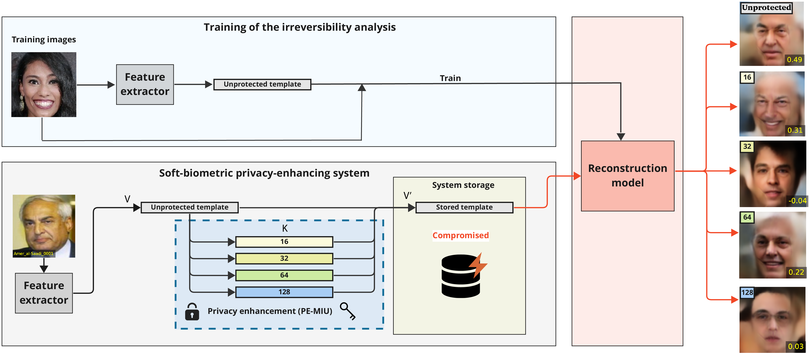
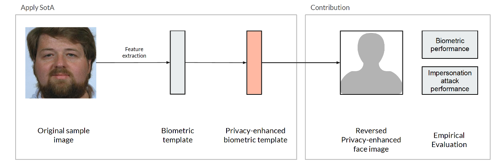
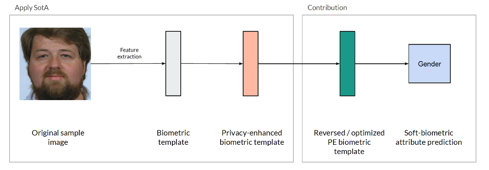
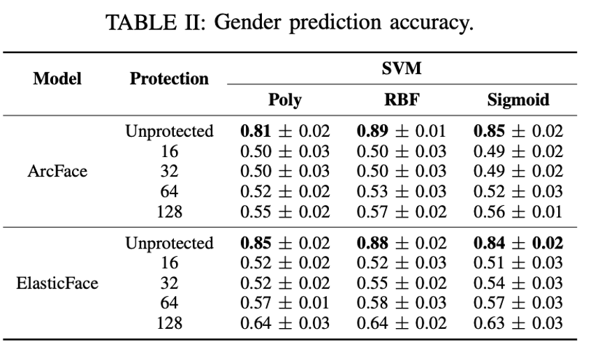
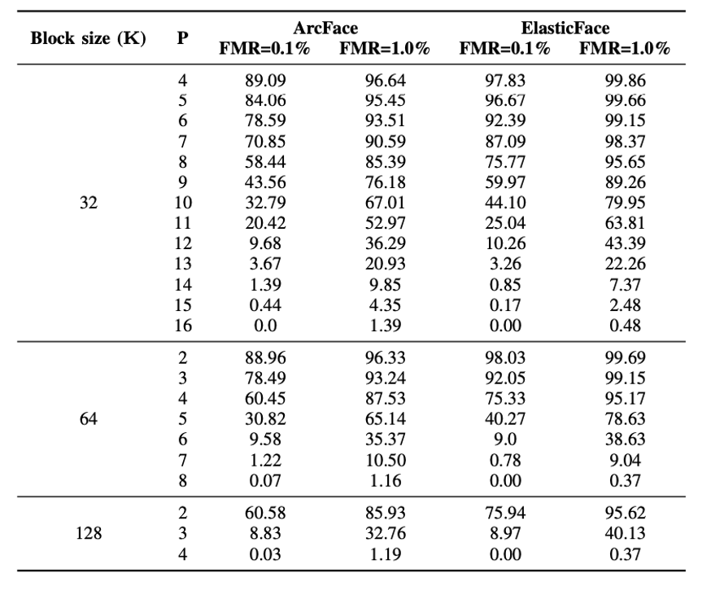
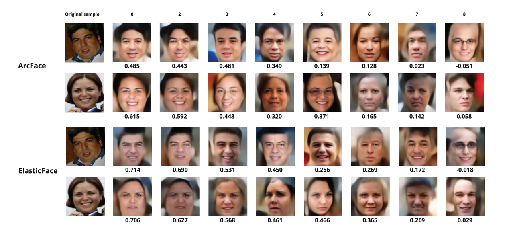

# Face Reconstruction from deep face protected embeddings

Refactored code used in the paper "Reversing Deep Face Embeddings with Probable Privacy Protection" (WIFS 2023, Osorio-Roig et al. (https://ieeexplore.ieee.org/abstract/document/10374819)). A summary of the paper can be found at the end of this README.



It contains an implementation of the [CNN](https://ieeexplore.ieee.org/abstract/document/9897535). This architecture focused on a CNN-based structure to reconstruct face images from face embeddings. Training is based on a multi-term loss function.

For the full protection of the privacy of face embeddings (i.e. in terms of gender prediction), it contains the implementation of [PE-MIU](https://ieeexplore.ieee.org/abstract/document/9094207). This method applies k permutations on a vector of floating point-based values (e.g. face embedding). It is important to highlight that this method modifies the distribution of the feature space by avoiding a high success chance of gender prediction. 

# Contribution
It is explored to what extent the non-invertibility requirement (i.e. face reconstruction and gender prediction) can be met by methods that claim to provide soft-biometric privacy protection like [PE-MIU](https://ieeexplore.ieee.org/abstract/document/9094207). To that end, a multi-term loss function of deconvolutional neural network was adapted to reconstruct face images from face embeddings protected by [PE-MIU](https://ieeexplore.ieee.org/abstract/document/9094207). 

### Installation

The package requires Python 3.9 or higher. Other dependencies are listed in the `requirements.txt` file. Install them with

```pip install -r requirements.txt```

### Usage

For the work of the databases used, please download the following databases:

[Source FFHQ](https://www.kaggle.com/datasets/arnaud58/flickrfaceshq-dataset-ffhq)
[Source LFW](https://vis-www.cs.umass.edu/lfw/)

For pre-processing datasets and alignment of face images, see [main.py](face_reconstruction/main.py).

For extraction of face embeddings, use [GenerateEmbeddings.py](face_reconstruction/src/GenerateEmbeddings.py)

For training of face reconstruction from protected face embeddings, see [train.py](face_reconstruction/train.py). Some face reconstruction results and gender prediction resulting from the training with the embedding extractors [ElasticFace](https://openaccess.thecvf.com/content/CVPR2022W/Biometrics/html/Boutros_ElasticFace_Elastic_Margin_Loss_for_Deep_Face_Recognition_CVPRW_2022_paper.html) and [ArcFace](https://openaccess.thecvf.com/content_CVPR_2019/html/Deng_ArcFace_Additive_Angular_Margin_Loss_for_Deep_Face_Recognition_CVPR_2019_paper.html) can be found in [final_eval_elasticface.ipynb](notebooks/final_eval_elasticface.ipynb) [final_eval_arcface.ipynb](notebooks/final_eval_arcface.ipynb) [reconstructed_samples.ipynb](notebooks/reconstructed_samples.ipynb).

For explainability results, see [saliency_map.ipynb](notebooks/saliency_map.ipynb).


Project Organization
------------

    ├── LICENSE
    ├── README.md          <- The top-level README for developers using this project.
    ├── requirements.txt   <- The requirements file for reproducing the analysis environment
    ├── figures            <- Figures for the README
    ├── notebooks          <- Jupyter notebooks for tutorials and examples
    │
    ├── data               <- Datasets should be downloaded here
    ├── dataframes         <- Results of similarity scores computed on the database LFW
    ├── evaluation         <- Results from DET curves. Evaluation in biometric systems.

    ├── face_reconstruction <- Training and Testing of the DNN

      │
      ├── src                    <- Contains implementation of the DNN
      │   ├── AttributePrediction <- Functions for gender prediction using machine learning methods.
      │   └── bob                 <- Contain functions for the invertibility pipeline.
      │   └── CosineSimilarity    <- Function of comparation 
      │   └── loss                <- Contain the loss functions pipeline.
      │   └── pemiu               <- [PE-MIU] protection method.
      ├── logs                    <- Contains some log results from the training process.
      
--------


Paper: Reversing Deep Face Embeddings with Probable Privacy Protection
------------

### Abstract

Generally, privacy-enhancing face recognition systems are designed to offer permanent protection of face embeddings. Recently, so-called soft-biometric privacy-enhancement approaches have been introduced with the aim of canceling soft-biometric attributes. These methods limit the amount of soft-biometric information (gender or skin-colour) that can be inferred from face embeddings. Previous work has underlined the need for research into rigorous evaluations and standardised evaluation protocols when assessing privacy protection capabilities. Motivated by this fact, this paper explores to what extent the non-invertibility requirement can be met by methods that claim to provide soft-biometric privacy protection. Additionally, a detailed vulnerability assessment of state-of-the-art face embedding extractors is analysed in terms of the transformation complexity used for privacy protection. In this context, a well-known state-of-the-art face image reconstruction approach has been evaluated on protected face embeddings to break soft biometric privacy protection. Experimental results show that biometric privacy-enhanced face embeddings can be reconstructed with an accuracy of up to approximately 98%, depending on the complexity of the protection algorithm. 

### DNN for face reconstruction

- The irreversibility analysis was based on the following workflow for face image synthesis:




- The invertibility pipeline was focused on the face reconstruction from shuffled face embeddings by the method [PE-MIU] and its corresponding gender prediction using classic machine learning techniques:  




### Experiments

#### Gender Prediction



- Low probability of gender prediction on protected face embeddings among the different classifiers as a function of K is perceived.

#### Accuracy of Face Reconstruction



- It should be also observed that the results attained for lower P values are directly proportional to the K
values, i.e. RSR improves as P and K drop.

- This observation could be explained due to the minimum information (entropy) that is managed across the blocks in the shuffling process which offers “useful” guesses of the floating-point values in the face reconstruction process.


#### Examples of face reconstruction for original face embeddings (i.e. unprotected embeddings) and for protected face embeddings.



- Examples of faces reconstructed from different permutations that also reveal gender information. 

### Citation

If you use this code in your research, please cite the following paper:

```{bibtex}
@inproceedings{osorio2023reversing,
  title={Reversing Deep Face Embeddings with Probable Privacy Protection},
  author={D. Osorio-Roig and P. Gerlitz and C. Rathgeb and C. Busch},
  booktitle={2023 IEEE Intl. Workshop on Information Forensics and Security (WIFS)},
  pages={1--6},
  year={2023},
  organization={IEEE}
}
```
In addition to contributors' articles:

```{bibtex}
@article{terhorst2020pe,
  title={PE-MIU: A training-free privacy-enhancing face recognition approach based on minimum information units},
  author={Terh{\"o}rst, Philipp and Riehl, Kevin and Damer, Naser and Rot, Peter and Bortolato, Blaz and Kirchbuchner, Florian and Struc, Vitomir and Kuijper, Arjan},
  journal={IEEE Access},
  volume={8},
  pages={93635--93647},
  year={2020},
  publisher={IEEE}
}
```

```{bibtex}
@inproceedings{shahreza2022face,
  title={Face reconstruction from deep facial embeddings using a convolutional neural network},
  author={Shahreza, Hatef Otroshi and Hahn, Vedrana Krivoku{\'c}a and Marcel, S{\'e}bastien},
  booktitle={2022 IEEE International Conference on Image Processing (ICIP)},
  pages={1211--1215},
  year={2022},
  organization={IEEE}
}
```